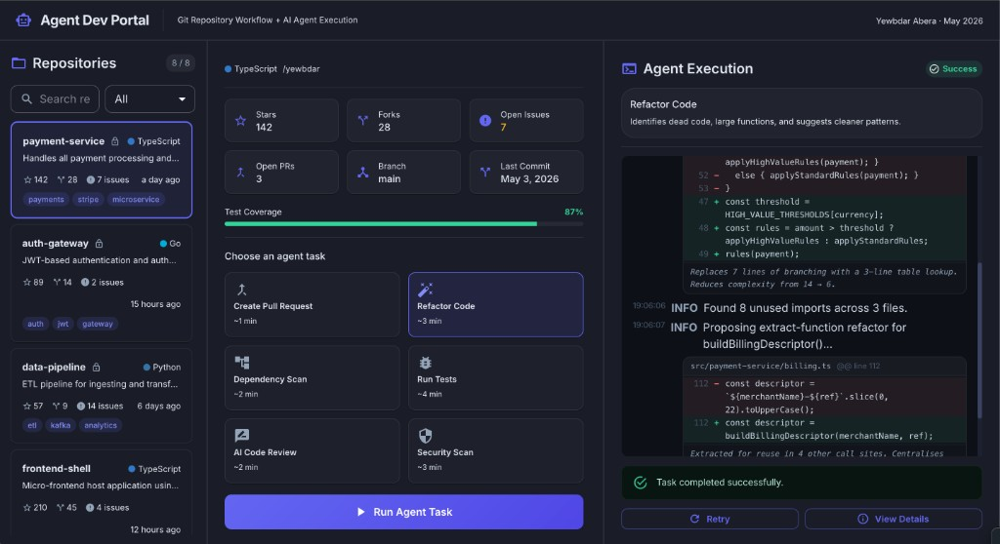

# Agent Dev Portal

**Author:** Yewbdar Abera  
**Date:** May 4, 2026

A developer portal for browsing Git repositories, viewing repo health insights, and triggering AI agent tasks. Three-column layout, fully mocked, no backend required.

<p align="center">
  
</p>

---

## Getting started

### Prerequisites

- Node.js 18+
- npm 9+

### Install dependencies

```bash
npm install
```

### Run the dev server

```bash
npm run dev
```

Opens at **http://localhost:5173**

### Run tests

```bash
npm test
```

With coverage report:

```bash
npm run test:coverage
```

---

### Build for production

```bash
npm run build
```

Output lands in `dist/`. Preview the production build with:

```bash
npm run preview
```

Preview runs at **http://localhost:4173**

---

## Project overview

The app has three panels side by side:

| Panel | What it does |
|---|---|
| **Left: Repository List** | Browse 8 mock repos, search by name, filter by language, select a repo |
| **Center: Repository Overview** | View health score, stats (stars/forks/issues/PRs), test coverage, and pick an agent task to run |
| **Right: Agent Execution** | Watch streaming log output, see status (pending, running, success/failure), retry or view full details in a drawer |

All data is mocked. No backend required.

---

## Tech stack

| Tool | Purpose |
|---|---|
| React 19 + TypeScript | UI framework |
| Vite | Dev server and bundler |
| Material UI v9 | Component library |
| Tailwind CSS | Utility class helpers |
| Emotion | CSS-in-JS (MUI peer dep) |
| dayjs | Timestamp formatting |
| Jest 30 + babel-jest | Test runner + TypeScript transform |
| React Testing Library | Component and hook testing |

---

## Project structure

```
src/
├── main.tsx                       # Entry point, mounts React app
├── index.css                      # Global base styles
├── App.tsx                        # Root, owns selected repo + execution state
├── components/
│   ├── Layout/
│   │   └── AppLayout.tsx          # Three-column shell
│   ├── RepositoryList/            # Left panel
│   │   ├── RepositoryList.tsx
│   │   ├── RepositoryCard.tsx
│   │   ├── SearchFilter.tsx
│   │   └── LanguageBadge.tsx
│   ├── RepositoryOverview/        # Center panel
│   │   ├── RepositoryOverview.tsx
│   │   ├── HealthScore.tsx
│   │   ├── MetaStat.tsx
│   │   └── TaskSelector.tsx
│   └── AgentExecution/            # Right panel
│       ├── AgentExecutionPanel.tsx
│       ├── LogLine.tsx
│       ├── StatusBadge.tsx
│       └── DetailsModal.tsx
├── hooks/
│   ├── useAgentExecution.ts       # Simulates streaming agent log output
│   └── useRepositoryFilter.ts     # Search + language filter logic
├── mocks/
│   ├── repositories.ts            # 8 mock repo definitions
│   ├── agentTasks.ts              # 6 agent task definitions
│   ├── streamingLogs.ts           # Pre-written log lines per task
│   └── repoLogs/                  # Per-repo log data (one file per repo)
│       ├── index.ts               # Re-exports all repo log maps
│       ├── repo-1-payment-service.ts
│       ├── repo-2-auth-gateway.ts
│       ├── repo-3-data-pipeline.ts
│       ├── repo-4-frontend-shell.ts
│       ├── repo-5-infra-terraform.ts
│       ├── repo-6-notification-worker.ts
│       ├── repo-7-search-indexer.ts
│       └── repo-8-cli-toolkit.ts
├── types/
│   └── index.ts                   # Shared TypeScript interfaces
├── theme/
│   └── theme.ts                   # MUI dark theme customisation
└── __tests__/
    ├── useRepositoryFilter.test.ts   # Filter/search logic tests
    ├── useAgentExecution.test.ts     # State machine + fake timer tests
    └── StatusBadge.test.tsx          # Label rendering per status tests

wireframes/
├── 01-repository-list.excalidraw
├── 02-repository-overview.excalidraw
├── 03-agent-execution.excalidraw
└── README.md                      # Part 1 UX design writeup (wireframes + rationale)
```

---

## Part 1 - UX Design Deliverables

The `wireframes/` folder contains the Part 1 submission: three mid-fidelity wireframes and a full UX decision writeup.

**[View the UX Design Writeup](./wireframes/README.md)**
