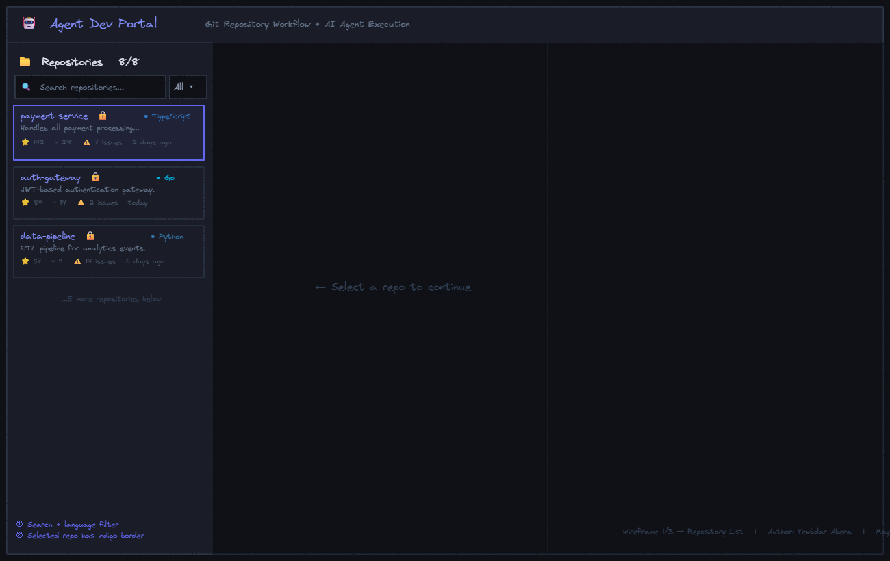
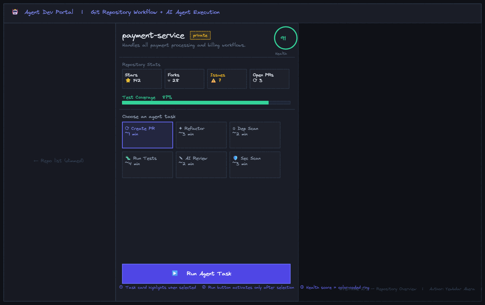
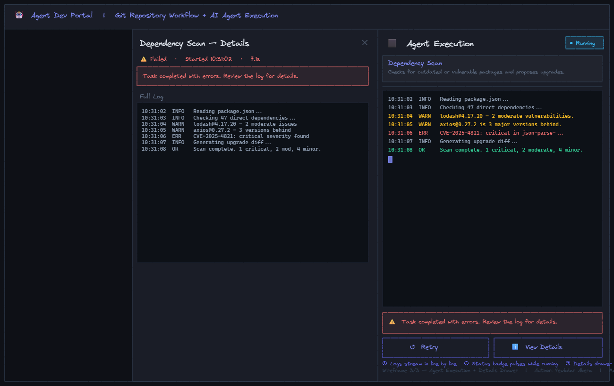

# Part 1 Deliverable - UX Design Writeup

**Project:** Agentic Developer Portal - Git Repository Workflow + Agent Execution UI  
**Author:** Yewbdar Abera  
**Date:** May 4, 2026

---

## Deliverable 1 - Wireframes

Three mid-fidelity wireframes covering the full end-to-end workflow.

---

### Screen 1 - Repository List

  

Left panel with search input, language filter chips, and scrollable repo cards showing name, language badge, health score, stars, and open issues.

---

### Screen 2 - Repository Overview

  

Center panel with repo metadata, circular health score ring, stat grid (stars/forks/issues/PRs), test coverage bar, and the agent task selector grid.

---

### Screen 3 - Agent Execution

  

Right panel showing the streaming log terminal, color-coded log lines, pulsing status badge, and Retry / View Details actions on completion.

---

| File | Screen | What it shows |
|---|---|---|
| `01-repository-list.excalidraw` | Repo List | Left panel with search, language filter, and repo cards |
| `02-repository-overview.excalidraw` | Repo Overview | Metadata, health score, coverage bar, and task selector |
| `03-agent-execution.excalidraw` | Agent Execution | Streaming log panel, status badge, retry/details actions |

### How to open

**Excalidraw (recommended)**
1. Go to [excalidraw.com](https://excalidraw.com)
2. Click the folder icon (top left) then Open
3. Select any `.excalidraw` file from this folder

**Figma**
1. Open the file at [excalidraw.com](https://excalidraw.com)
2. Menu, Export image, SVG
3. In Figma: File, Import or drag the SVG into any frame

---

## Deliverable 2 - UX Decision Writeup

### Problem framing

Developers need a fast, low-friction way to select a repository, understand its current state, and hand off repetitive tasks to an AI agent without switching between six different tools. The portal collapses that into one focused screen.

---

### Layout decision: three columns, always visible

I chose a persistent three-column layout instead of a wizard or stepper because developers are not beginners. They want to see all three contexts -- the repo list, the repo details, and the running agent -- at the same time. The columns let them:

- Quickly switch repos without losing the current execution log
- Compare a running task's output against the repo metadata side-by-side
- Retry without navigating away

The left column is narrower (300px) because it is just a picker. The center and right share equal space because both carry dense, important information.

---

### Repository List - design choices

**Search + language filter above the fold.** Developers with 50+ repos use search constantly. Putting it at the top is the obvious call. The language filter is a secondary control so it is smaller and to the right.

**Cards instead of a table.** A table would work, but cards let me surface the description, topics, and freshness without forcing the developer to expand a row. The selected card uses a two-pixel indigo border -- strong enough to read at a glance, not visually loud.

**Relative timestamps.** "2 days ago" is more useful than "2026-05-02" when you are scanning for stale repos. Absolute dates live in the overview panel for precision.

---

### Repository Overview - design choices

**Health score as a circular ring.** A single 0-100 number with a color-coded ring (green/yellow/red) lets a developer assess the repo in under a second. It sits top-right so it does not interrupt the name and description scan path.

**Coverage bar below the stat grid.** Coverage is important enough to call out separately. A progress bar communicates "87% of a whole" much faster than a number inside a grid tile. The color shifts from green to yellow below 80%.

**Task grid before the Run button.** Forcing a task selection before enabling the button prevents accidental runs. The grid uses small cards (not a dropdown) so all six options are visible simultaneously -- developers can read the estimated time and description without opening a menu.

**Disabled button state.** When no task is selected, the button reads "Select a task above" and is greyed out. This guides the user without an error message.

---

### Agent Execution Panel - design choices

**Terminal aesthetic for the log area.** Developers trust a monospace log. Using a dark terminal background (`#0d1117`) inside the panel makes it immediately clear this is raw agent output, not a UI message. Log lines are color-coded: grey for info, yellow for warnings, red for errors, green for success.

**Auto-scroll to bottom.** As lines stream in, the log scrolls automatically so the developer always sees the latest output -- the same behavior they expect from a real terminal or CI log.

**Status badge that pulses.** A pulsing "Running" chip is a low-cost way to signal liveness without a spinning overlay that blocks the log content.

**Retry and View Details only on completion.** These buttons appear only after the run finishes (success or failed). While running, they would be confusing. After finishing, Retry re-runs the exact same task so the developer does not need to re-navigate.

**Details drawer, not a modal.** A drawer slides in from the right without covering the log panel entirely. The developer can still see the status badge and the summary while reading the full log in the drawer. A modal would force them to close it before seeing the panel again.

---

### Color language

| Color | Meaning |
|---|---|
| Indigo (`#6366f1`) | Selected state, primary CTA, active task |
| Cyan (`#38bdf8`) | Running / live state |
| Green (`#34d399`) | Success, good coverage, healthy score |
| Yellow (`#fbbf24`) | Warnings, medium issues, private badge |
| Red (`#f87171`) | Errors, failures, critical findings |
| Slate grey | Secondary text, inactive states |

---

### What I would do next (if this were production)

1. **Real-time via WebSockets or SSE** - swap `setInterval` in `useAgentExecution` for a real stream connection
2. **Pagination / infinite scroll** on the repo list for large orgs
3. **Task history** - a log of past runs per repo so developers can compare results over time
4. **Keyboard shortcuts** - `R` to retry, `D` for details, `Esc` to close drawer
5. **Responsive layout** - stack the three columns vertically on tablet/mobile
